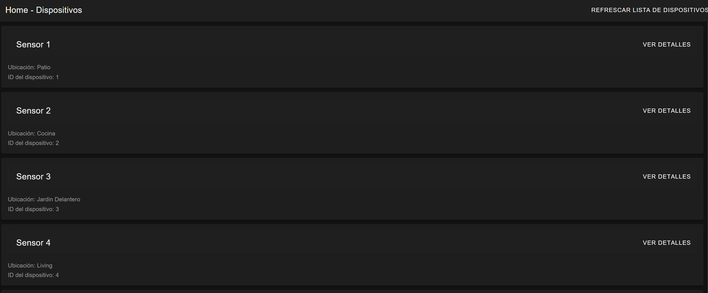
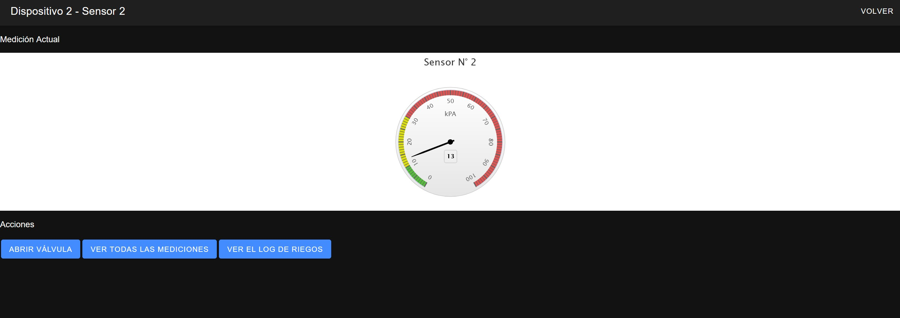
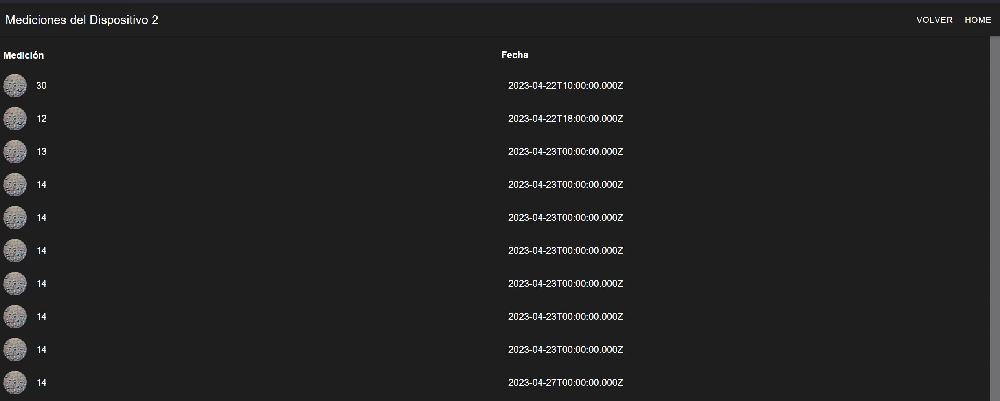
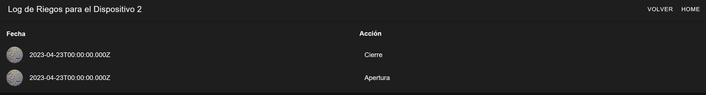

# ceiot_dam-tp
CEIoT - TP Final - Desarrollo de Aplicaciones Multiplataforma

Simón Rodríguez

# Pasos para inicializar el proyecto:

1. Levantar el docker con `docker compose up`.
2. Ir a la carpeta /src/backend y ejecutar `npm install`.
3. Ir a la carpeta /src/frontend/dam y ejecutar `npm install`.
4. En caso de tener problemas con el módulo Highcharts (gráfico para la medición), se debe agregar al docker.

**Nota:** en caso de necesitar ingresar por la ventana de login, usar test/1234.

# Características de la WebApp:

La aplicación puede hacaer lo siguiente:
1. Dar un listado de dispositivos.

2. Al entrar a algún dispositivo, brindar el último valor de medición por sensor en el gráfico.
3. Tener la opción dentro de la vista del dispositivo con sus medición, de poder abrir la electroválvula que le corresponde. 
   * En el caso de que se abra o se cierre dicha electroválvula, se deberá insertar un registro en la tabla de Log_Riegos
   * Si se cierra la válvula se realiza un insert sobre la tabla de mediciones para crear un nuevo registro con el nuevo valor.

4. Tener otra opción que permita ver todas las mediciones de ese sensor como una tabla.

5. Poder consultar el log de los riegos para una electroválvula.

**Notas**:
1. Para simular los valores del sensor, existe una función intervalo que se activa al momento de ingresar a la página de la medición actual (localhost:8100/dispositivo/:id). A medida que se van actualizando los valores en el gráfico, también se van incluyendo en la tabla de mediciones como si fueran lecturas del sensor.
2. Para fines de este TP, no se toma en cuenta el estado actual de las electroválvulas, es decir, si están abiertas o cerradas. Se consideran que todas están cerradas al momento de ingresar al sitio.
3. Al abrir la válvula, el valor del sensor va a '0', simulando que el suelo se riega inmediatamente; sin embargo, este valor no se guarda en la tabla de mediciones hasta que se cierre la válvula (o se vuelva a obtener una lectura del sensor o simulación).

# Otras consideraciones de la app:

● 2 Directivas estructurales (ngIf, ngFor)
  1. Se usó ngIf para modificar el botón que controla la apertura o el cierre de la válvula, dependiendo del estado actual de la misma.
  2. Se usó ngFor para crear la lista de dispositivos, la lista de mediciones y la lista de registros de riego.

● 1 directiva de atributo (custom)
  - Se creó la directiva (color-boton.directive.ts) para configurar el color del botón cuando se pasa el mouse por encima del mismo. Esta directiva se aplicó a los botones "Refrescar Lista de Dispositivos" y "Ver Detalles" de la página inicial (/home).

● 1 pipe custom
  - Se creo un pipe (transformar-estado.pipe.ts) para transformar la acción de abrir o cerrar una válvula que se almacena como un número [0,1] en la base de datos a una palabra más fácil de interpretar por el usuario [apertura, cierre].

● 1 servicio para conectar a la API
  - El servicio para conectar con la api se llama 'DispositivoService'.

● 1 Api en Express con comunicación a la base de datos
  - Se tienen los siguientes Endpoints:

    /devices
    /devices/:id
    /lastmeasurement/:id
    /measurements/:id
    /waterlog/:id
    /changestate
    /updatemeasurements

